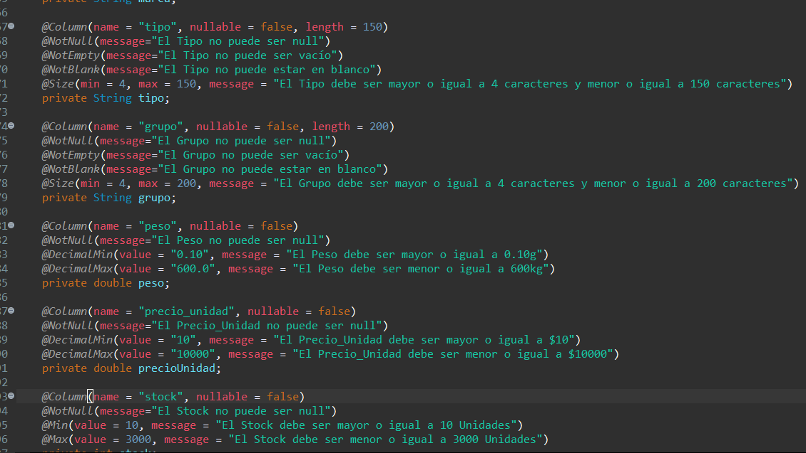

# ApiRest Micro Front End Productos de Supermercado

* Api Rest para el Microservice App_MicroFrontEnd_Productos implementado con Spring Boot, Spring MVC, Spring Security, JWT , Spring Data JPA, SpringFox, Swagger UI, Maven, Lombok, Postman, Log4j, Git, DBeaver, pgAdmin y PostgreSQL.


</br>

* [Repositorio base de datos](https://github.com/andresWeitzel/Microdb_productos_supermercado_PostgreSQL)
* [Repositorio App_MicroFrontEnd_Productos](https://github.com/andresWeitzel/App_MicroFrontEnd_Productos_SpringBoot_SpringSecurity_PostgreSQL)
* [PlayList del Proyecto](https://www.youtube.com/playlist?list=PLCl11UFjHurBM42b3iBbQ7iilddzG4t_L)


<br>

## Índice 📜

<details>
 <summary> Ver </summary>
 
 <br>
 
### Sección 1) Descripción, Tecnologías y Dependencias 

 - [1.0) Descripción del Proyecto.](#10-descripción-)
 - [1.1) Ejecución del Proyecto.](#11-ejecución-del-proyecto-)
 - [1.2) Patrones de Diseño.](#12-patrones-de-diseño-)
 - [1.3) Tecnologías.](#13-tecnologías-)
 - [1.4) Dependencias Maven.](#14-dependencias-maven-)

  
### Sección 2) Endpoints y Recursos 
 
 - [2.0) EndPoints.](#20-endpoints-)
 - [2.1) Recursos por endpoints.](#21-recursos-por-endpoints-)
  
  
### Sección 3) Prueba de Funcionalidad y Referencias
 
 - [3.0) Prueba de Funcionalidad.](#30-prueba-de-funcionalidad-)
 - [3.1) Referencias.](#31-referencias-)
	  
  
  
<br>

</details>


<br>

## Sección 1) Descripción, Tecnologías y Dependencias 


### 1.0) Descripción [🔝](#índice-) 

<details>
  <summary>Ver</summary>
 
 <br>
 
* La Api Rest implementa todas las Operaciones CRUD, tanto para productos como para usuarios. 
* Se separa la capa de seguridad para la autenticación , implementando Spring Security y JWT. 
* Además de realizar las operaciones CRUD para usuarios se aplica login y signin para la capa de presentación.
* También se desarrollan los métodos de búsquedas independientes de tipo Like para todos los campos, tanto de usuarios como productos.
* Los objetos de tipo getBy se manipulan como paginados, salvo los getById y Optional que se requiere un response por objeto y no una E.D como de tipo lista, stream, etc.
* Se desarrollan clases específicas para el manejo de excepciones para cada servicio , como también un manejador de excepciones y validaciones por campos de beans.
* Todas las funcionalidades tienen generación de logs en el Server para los errores y excepciones personalizadas.
* Se incluye documentación completa de la Api con SpringFox para la visualización con swagger-ui, las anotaciones de open-api se aplican junto con los códigos de respuesta de tipo HTTP para cada función en los respectivos controllers.
* Se pone a disposición todos los recursos anteriores para productos y usuarios.
* Entre otros.

</br>

* [Repositorio base de datos](https://github.com/andresWeitzel/Microdb_productos_supermercado_PostgreSQL)
* [Repositorio App_MicroFrontEnd_Productos](https://github.com/andresWeitzel/App_MicroFrontEnd_Productos_SpringBoot_SpringSecurity_PostgreSQL)
* [PlayList del Proyecto](https://www.youtube.com/playlist?list=PLCl11UFjHurBM42b3iBbQ7iilddzG4t_L)


<br>

</details>


### 1.1) Ejecución del Proyecto [🔝](#índice-)

<details>
  <summary>Ver</summary>
  
 <br>  
  
* Ejecutar la base de datos del proyecto.
* Crear un entorno de trabajo a través de algún IDE (Para este caso utilizo STS 4). 
* Clonar el Proyecto (`git clone https://github.com/andresWeitzel/ApiRest_MicroFrontEnd_ProductosSupermercado`)
* Utilizando sts, dentro del package explorer click derecho sobre el proyecto, run as spring boot app.
* Verificar logs del server.
* Comprobar cada endpoint.

<br>

</details>


### 1.2) Patrones de Diseño [🔝](#índice-)

<details>
  <summary>Ver</summary>
  <br>

| **Patrón de Diseño** | **Finalidad** |               
| ------------- | ------------- |
| [DAO](https://www.oscarblancarteblog.com/2018/12/10/data-access-object-dao-pattern/) | Uso de interfaces entre la aplicación y el almacenamiento de datos. |
| [MVC](https://keepcoding.io/blog/que-es-el-patron-de-arquitectura-mvvm/) | Separación y Representación de los Datos, Manejo de errores, Escalabilidad, etc  |
| [DTO](https://www.oscarblancarteblog.com/2018/11/30/data-transfer-object-dto-patron-diseno/) | Transferencia de objectos separando la capa de acceso a datos  |
| [Dependency Inyection](https://en.wikipedia.org/wiki/Dependency_injection) | Uso de funcionalidades requeridas de clases a través de inyección |

<br>
</details>


### 1.3) Tecnologías [🔝](#índice-)

<details>
  <summary>Ver</summary>
 
 <br>

| Tecnología | Versión | Finalidad
| ------------- | ------------- | ------------- |
| [Java]( https://www.oracle.com/java/technologies/javase/jdk12-archive-downloads.html) |   12.0.2 | JDK |
| [Spring Tool Suite 4](https://spring.io/blog/2021/06/21/spring-tools-4-11-0-released) | 4.9.0  | IDE |
| [Spring Boot](https://spring.io/) |   2.6.4  | Framework |
| [Spring Boot Data JPA](https://spring.io/projects/spring-data-jpa)  | 2.6.3 | Mapeo de objetos y persistencia en la db |
| [Spring Security](https://spring.io/projects/spring-security) | 2.6.7 | Servicios de Seguridad |
| [JSON Web Token](https://jwt.io/) | 0.9.1 | Creación de tokens de acceso | 
| [Maven](https://maven.apache.org/) |  4.0.0 | Gestor de Proyectos |
| [Postman](https://www.postman.com/) | 9.4.1 | Test de Apis |
| [Lombok](https://projectlombok.org/) | 1.18.22 | Automatización de Código | 
| [SpringFox](https://github.com/springfox/springfox) | 3.0.0 | Documentación de la Api | 
| [UI Swagger](https://swagger.io/tools/swagger-ui/) | 1.6.4 | Visualización y Gestión de la Api | 
| [PostgreSQL](https://www.postgresql.org/) | 13.2 | Sistema de Gestión de DB'S |
| [DBeaver](https://dbeaver.io/) | 22.1  | Editor de Base de Datos |
| [pgAdmin](https://github.com/pgadmin-org/pgadmin4) | 5.1 | Sistema de Administración de DB'S |
| [GNU bash / Terminal](https://www.gnu.org/software/bash/) | 4.4.23  | Bash / Terminal para el manejo e implementación de Git integrado al Spring Tool Suite |
| [Git](https://git-scm.com/) | 2.29.1  | Control de Versiones |


<br>

</details>


### 1.4) Dependencias Maven [🔝](#índice-)

<details>
 <summary>Ver</summary>
 
 <br>

| **Dependencia Maven**  | **Versión** | **Finalidad** |             
| ------------- | ------------- | ------------- |
| spring-boot-starter-data-jpa | 2.6.7 | Api de JpaRepository para el manejo de métodos | 
| spring-boot-starter-test | 2.6.7 | Para Testing | 
| spring-boot-starter-web | 2.6.7 | Se agrega toda la configuración web automáticamente de Maven a Spring | 
| spring-boot-starter-validation | 2.7.0 | Validación de Annotations |
| spring-boot-devtools | 2.6.7 | Herramientas para el Manejo de Spring Boot | 
| spring-boot-starter-security | 2.6.7 | Módulo de Seguridad de Spring |
| jjwt | 0.9.1 | Manejo de Token's |
| nimbus-jose-jwt | 9.22 | Refresh Token |
| jaxb-api | 4.0 | Serialización de Objetos Java a XML |
| jackson-databind | 4.0 | Serialización de Objetos Java a JSON |
| javax-annotation-api | 4.0 | Api para la lectura de annotations|
| springfox-boot-starter | 3.0.0 | Doc Api |
| springfox-swagger-ui | 3.0.0 | Doc Api |
| postgresql | 42.3.4 | Driver para el SGDB PostgreSQL | 
| lombok | 1.18.22 |  Dependencia para la automatización de Código |


<br>

</details>


<br>

## Sección 2) EndPoints y Recursos

### 2.0) EndPoints [🔝](#índice-)

<details>
 <summary>Ver</summary>
 
### EndPoints Generales
* http://localhost:8098/api/v1/productos/
* http://localhost:8098/api/v1/admin/usuarios/
* http://localhost:8098/api/v1/auth/


### Descripción Api Rest
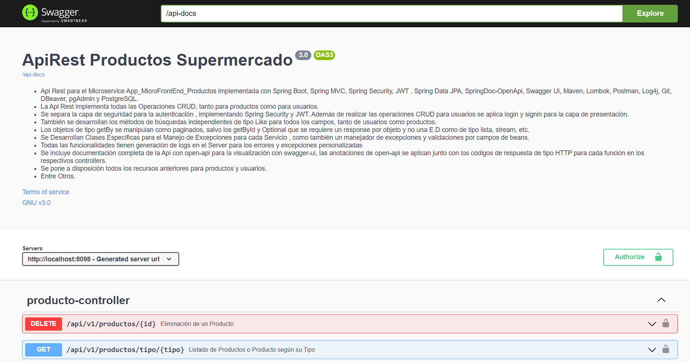

### Response Modelo Códigos Http
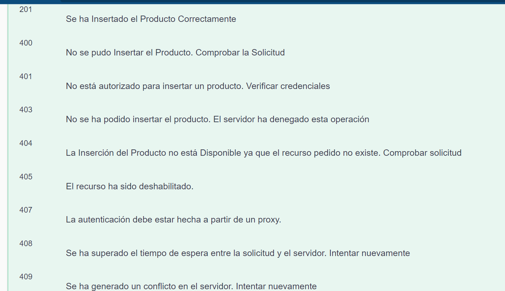
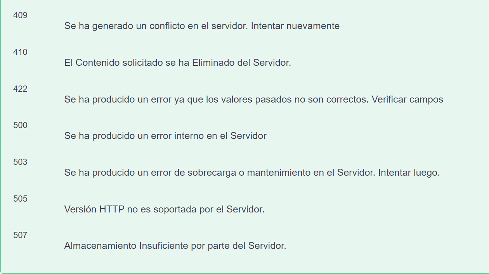

### Beans Validations 


<br>

</details>


### 2.1) Recursos por Endpoints[🔝](#índice-)

<details>
 <summary>Ver</summary>
 
* Algunos de los recursos de cada endpoint se muestran en las siguientes imágenes.
 
### Producto Controller. 


### Usuario Controller. 
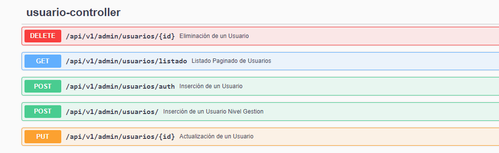


### Auth Controller. 
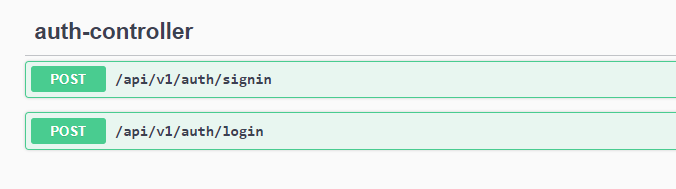
 
<br>

</details>


<br>

## Sección 3) Prueba de Funcionalidad y Referencias


### 3.0) Prueba de Funcionalidad [🔝](#índice-)

<details>
 <summary>Ver</summary>


### Login y Signin | [Ver funcionalidad](https://www.youtube.com/watch?v=vxmJAXwahNk&list=PLCl11UFjHurBM42b3iBbQ7iilddzG4t_L&index=2)  
[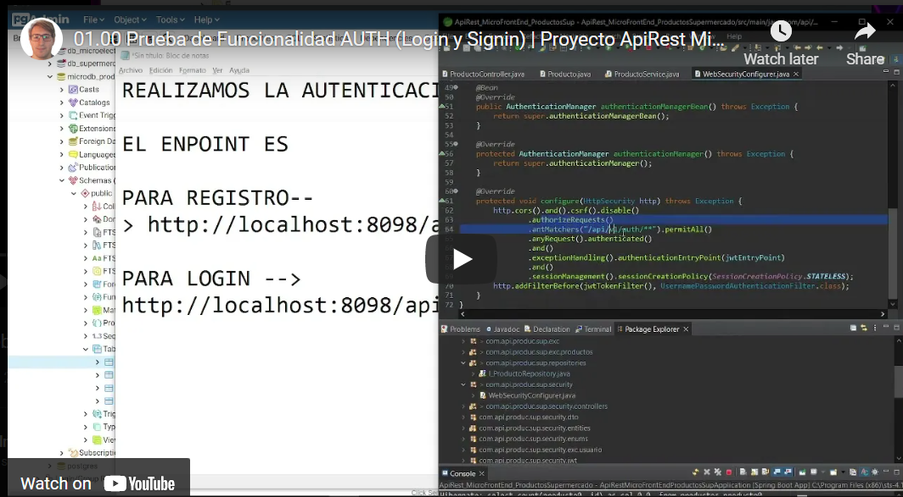](https://www.youtube.com/watch?v=vxmJAXwahNk&list=PLCl11UFjHurBM42b3iBbQ7iilddzG4t_L&index=2) 

### Refresh Token | [Ver funcionalidad](https://www.youtube.com/watch?v=P_iGkoIgXFM&list=PLCl11UFjHurBM42b3iBbQ7iilddzG4t_L&index=3) 
[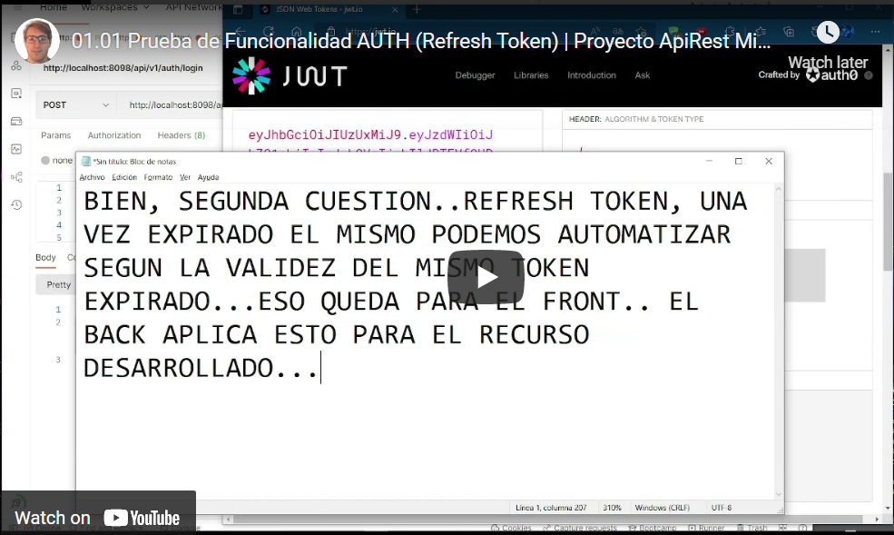](https://www.youtube.com/watch?v=P_iGkoIgXFM&list=PLCl11UFjHurBM42b3iBbQ7iilddzG4t_L&index=3) 

### Usuario Controller | [Ver funcionalidad](https://www.youtube.com/watch?v=eG7dirCPflU&list=PLCl11UFjHurBM42b3iBbQ7iilddzG4t_L&index=3) 
[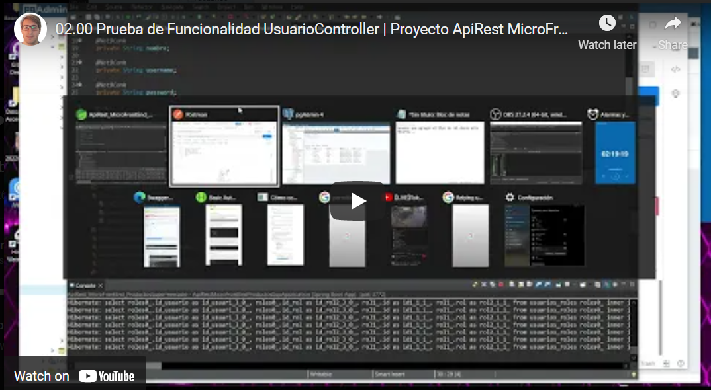](https://www.youtube.com/watch?v=eG7dirCPflU&list=PLCl11UFjHurBM42b3iBbQ7iilddzG4t_L&index=3) 


### Usuario Bean Validations (Add) | [Ver funcionalidad](https://www.youtube.com/watch?v=U-6sD-k4_lg&list=PLCl11UFjHurBM42b3iBbQ7iilddzG4t_L&index=4) 
[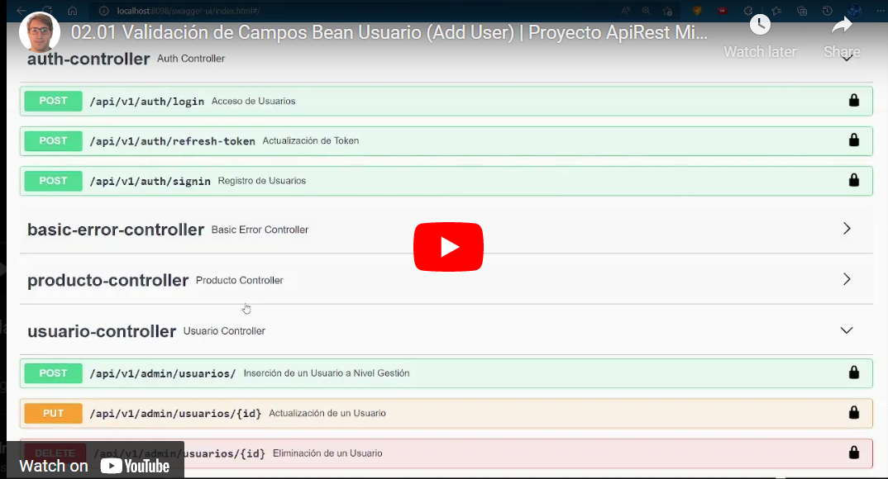](https://www.youtube.com/watch?v=U-6sD-k4_lg&list=PLCl11UFjHurBM42b3iBbQ7iilddzG4t_L&index=4) 


### Usuario Bean Validations (Update and Delete) | [Ver funcionalidad](https://www.youtube.com/watch?v=o8vOd0dERFI&list=PLCl11UFjHurBM42b3iBbQ7iilddzG4t_L&index=5) 
[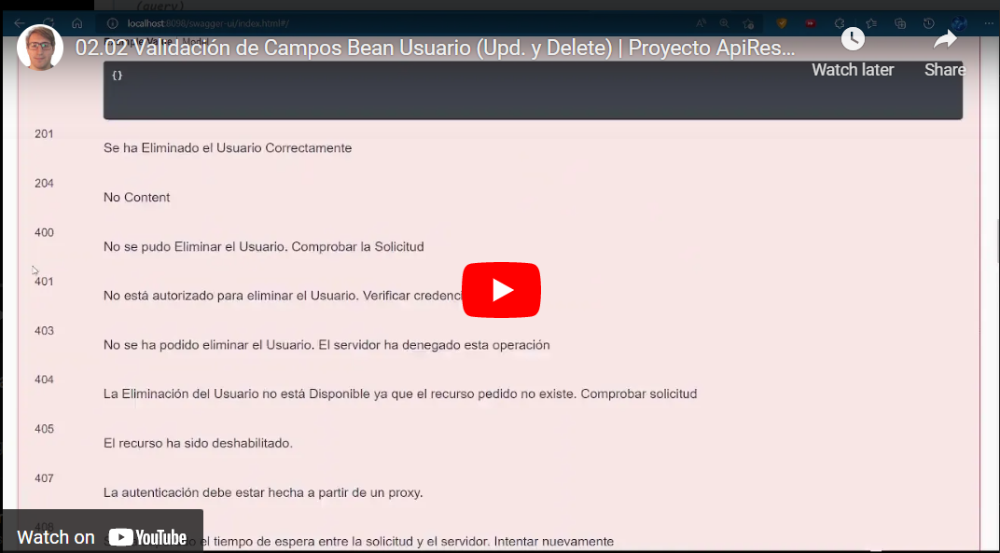](https://www.youtube.com/watch?v=o8vOd0dERFI&list=PLCl11UFjHurBM42b3iBbQ7iilddzG4t_L&index=5) 


### Producto Controller | [Ver funcionalidad](https://www.youtube.com/watch?v=JqrTA97Y4N4&list=PLCl11UFjHurBM42b3iBbQ7iilddzG4t_L&index=4) 
[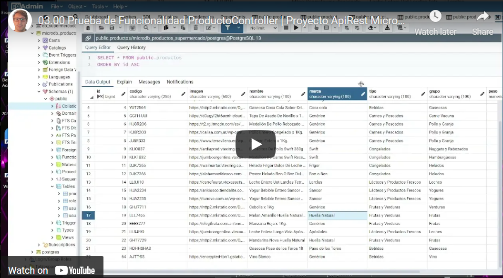](https://www.youtube.com/watch?v=JqrTA97Y4N4&list=PLCl11UFjHurBM42b3iBbQ7iilddzG4t_L&index=4) 

### Producto Bean Validations | [Ver funcionalidad](https://www.youtube.com/watch?v=ytdwagCbJXU&list=PLCl11UFjHurBM42b3iBbQ7iilddzG4t_L&index=7)
[](https://www.youtube.com/watch?v=ytdwagCbJXU&list=PLCl11UFjHurBM42b3iBbQ7iilddzG4t_L&index=7) 


### Documentación SwaggerUI-SpringFox | [Ver funcionalidad](https://www.youtube.com/watch?v=F2BlURXQaDs&list=PLCl11UFjHurBM42b3iBbQ7iilddzG4t_L&index=5) 
[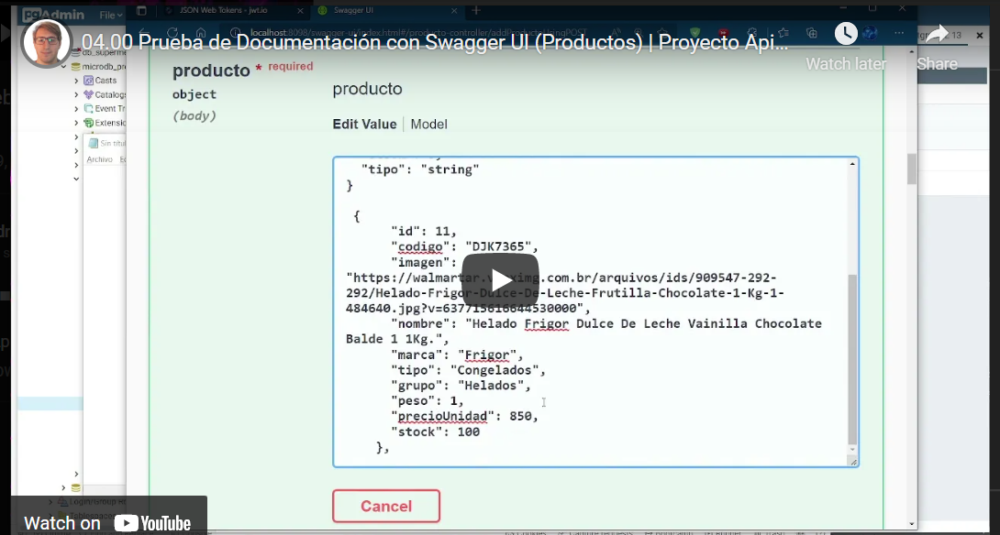](https://www.youtube.com/watch?v=F2BlURXQaDs&list=PLCl11UFjHurBM42b3iBbQ7iilddzG4t_L&index=5) 


<br>

</details>


### 3.1) Referencias [🔝](#índice-)

<details>
 <summary>Ver</summary>

### Doc No Oficial Recomendada
* [Config Swagger](https://www.baeldung.com/swagger-set-example-description)
* [Generar doc con swagger](https://howtodoinjava.com/swagger2/swagger-spring-mvc-rest-example/)
* [Api Response con swagger](https://docs.swagger.io/swagger-core/v1.5.0/apidocs/io/swagger/annotations/ApiResponse.html)
* [Códigos HTTP de respuestas desarrollar en apis](https://www.ibm.com/docs/es/odm/8.5.1?topic=api-rest-response-codes-error-messages)

### Doc Gráfica No Oficial Recomendada
* [Implementación de Spring Security y JWT Youtube](https://www.youtube.com/watch?v=_91iKzsKdqY&list=PL4bT56Uw3S4z9rtwwGvuk1Mjhu5sdLSwX&index=12)
* [Implementación Spring Security](https://www.youtube.com/watch?v=tDZPdovCH4I)
* [Tutorial doc open-api](https://www.youtube.com/watch?v=iaVBleTf88U)


 <br>

</details>


<br>

<br>

<br>

### `Siguiente sección en proceso de actualización` 

<details>
 <summary>Ver</summary>


<hr>

## ` Documentación y Guía del Proyecto `
#### (Esta Documentación que Desarrollé es para la Creación y Configuración de la API Rest, Manejo y Dependencias de Maven, Spring Tool Suite, Spring Boot, Spring Security, JWT, PostgreSQL, SpringFox, Swagger UI y otros usos. Esta guía solamente abarca algunos puntos de configuración, si se requiere especificidad para algún caso concreto dirigirse a los links que se anexan en cada paso. Recomiendo Leerla y Realizar todo paso a paso como se indica en la misma ).

</br>

## Indice

#### Sección 1) Creación y Configuraciones del Proyecto 
   
   - [Paso 1) Creación y Configuraciones de un Proyecto Spring Boot con Maven en Spring Tool Suite 4.](#paso-1-creación-de-un-proyecto-spring-boot-con-maven-en-spring-tool-suite-4-y-configuraciones-iniciales)
  
   - [Paso 2) Otras Configuraciones del Proyecto.](#paso-2-otras-configuraciones-del-proyecto)


#### Sección 2) Dependencias del Proyecto, Descarga de Lombok y Archivo de Propiedades
   
   - [Paso 3) Listado de Dependencias.](#paso-3-listado-de-dependencias)

   - [Paso 4) Descarga de Lombok.](#paso-4-descarga-de-lombok)
   
   - [Paso 5) Archivo de Propiedades(application.properties).](#paso-5-configuraciones-del-application.properties) 
   


#### Sección 3) Creación y Configuración de Clases Entities/Models
  
   - Paso 6) Seguir paso a paso la respectiva sección de la guía de la siguiente api: https://github.com/andresWeitzel/ApiRest_Microelectronica_SpringBoot_Oracle
  
  
#### Sección 4) Creación y Configuración de las Interfaces Repositories  

   - Paso 7) Seguir paso a paso la respectiva sección de la guía de la siguiente api: https://github.com/andresWeitzel/ApiRest_Microelectronica_SpringBoot_Oracle
  

#### Sección 5) Creación y Configuración de los Services y Excepciones de Clase

   - Paso 8) Seguir paso a paso la respectiva sección de la guía de la siguiente api: https://github.com/andresWeitzel/ApiRest_Microelectronica_SpringBoot_Oracle
  

#### Sección 6) Creación y Configuración de los Controllers
	
   - Paso 9) Seguir paso a paso la respectiva sección de la guía de la siguiente api: https://github.com/andresWeitzel/ApiRest_Microelectronica_SpringBoot_Oracle
  


#### Sección 8) Prueba de los Servicios Rest Desarrollados

   - [Paso x) Desarrollar...


#### Sección 9) Uso y Manejo de Git

   - [Paso 26) Descarga y Configuración de Git](#paso-26-descarga-y-configuración-de-git)

   - [Paso 27) Subir el proyecto al repositorio de github desde la consola de git](#paso-27-subir-el-proyecto-al-repositorio-de-github-desde-la-consola-de-git)
   - [Paso 28) Actualización del repositorio del proyecto desde la consola de GIT](#paso-28-actualización-del-repositorio-del-proyecto-desde-la-consola-de-GIT)


</br>

## Sección 1) Creación y Configuraciones del Proyecto 

</br>


### Paso 1) Creación de un Proyecto Spring Boot con Maven en Spring Tool Suite 4 y Configuraciones Iniciales.
#### (Primeramente deberás configurar tu espacio de trabajo, en donde se alojará la aplicación. Cada vez que muevas el Proyecto de Directorio, recomiendo crear o setear nuevamente el Espacio de Trabajo).


* Una vez abierto Spring Tool Suite 4
  	* --> Seleccionas la Pestaña `File` 
   	* --> New 
   	* --> Spring Starter Proyect (Si no aparece buscar en Other).

* Se abrirá una Interfaz Gráfica, por defecto dejar marcado lo siguiente con los siguientes valores por defecto
   	 * --> Service Url : https://start.spring.io
   	 * --> Use default location por defecto (es la ruta absoluta de tu workspace)
   	 * --> Type : Maven
	 * --> Java Version : 11
	 * --> Packaging : Jar
	 * --> Language : Java
	 * --> Artifact : Por Defecto como está (cambia automáticamente cuando escribimos el Name del Proyect)
	  * --> Version  : Por Defecto como está
	  * --> Working Sets Desmarcado.

* Configuramos lo restante
   * --> Name : ApiRest_NombreDelproyecto. Luego debe cambiarse aut. el Artifact
   * --> Group : com.api.nombre (Nombre del grupo + Referencia de api + Nombre del Proyecto).
   * --> Description: la deseada.
   * --> Package : com.api.nombre 
   * --> Next

* En la Nueva Interfaz Gráfica elegimos la versión y dependencia
   * --> Spring Boot Versión : 2.6.7 o una que no sea la última
   * --> Vamos a seleccionar las dependencias necesarias
   * --> Dependencias : Spring Web, Spring Data JPA, Spring Boot DevTools, Lombok, Spring Security, Postgres y si falta alguna se añade luego en el pom.xml desde maven repositories.
   * --> Next, Next y Seguidamente Finish.

* Esperar a que finalice Spring la creación del Proyecto


</br>


### Paso 2) Otras Configuraciones del Proyecto.
#### (Para este paso se anexan configuraciones que para el Proyecto son relevantes, capaz creando el Proyecto desde otro IDE se autoconfiguran dichas configuraciones).

</br>

#### 2.1) Actualización de Java-1.7 a 1.8 (Si seleccionaste una versión Moderna de Spring no es Necesario esto)

* Vamos al `pom.xml` (el archivo al final de todo)

* Dentro de el tag `properties` donde dice java.versión cambiar la version del compiler a 1.8, ctrl+s para guardar

* Click Derecho sobre el Proyecto
	* --> Maven
	* --> Update Proyect
	* --> Fijate que el Proyecto este seleccionado y Boton ok

* Si cambio JavaSE-1.7 a JavaSE-1.8 se efectuo el cambio

</br>

#### 2.2) Paquetes Maven `(Java Resources)`. (Si seleccionaste una versión Moderna de Spring no es Necesario esto)

* Por Defecto Viene deshabilitada la opción de paquetes Maven, en donde vamos a guardar nuestros paquetes y clases
	* --> Para habilitar las mismas, click Der sobre el Proyecto.
	* --> Properties.
	* --> Buscamos la sección `Java Build Path`
	* --> Seleccionamos la casilla `Maven Dependencies`.
	* --> Apply and Close.
	* --> F5 y deberían aparecer `src/main/java` y `src/test/java`


</br>

## Sección 2) Dependencias del Proyecto, Descarga de Lombok y Uso del SGDB PostgreSQL

</br>


### Paso 3) Listado de Dependencias
#### (Las siguientes dependencias del Proyecto deberán estar en el pom.xml para el correcto funcionamiento del Proyecto. Puede ocurrir que haya más dependencias que las mencionadas, por defecto spring proporciona las generales, el resto las buscamos desde Maven Repositories).


```xml
<?xml version="1.0" encoding="UTF-8"?>
<project xmlns="http://maven.apache.org/POM/4.0.0"
	xmlns:xsi="http://www.w3.org/2001/XMLSchema-instance"
	xsi:schemaLocation="http://maven.apache.org/POM/4.0.0 https://maven.apache.org/xsd/maven-4.0.0.xsd">
	<modelVersion>4.0.0</modelVersion>
	<parent>
		<groupId>org.springframework.boot</groupId>
		<artifactId>spring-boot-starter-parent</artifactId>
		<version>2.6.7</version>
		<relativePath /> <!-- lookup parent from repository -->
	</parent>
	<groupId>com.api.rest.productos.supermercado</groupId>
	<artifactId>ApiRest_MicroFrontEnd_ProductosSup</artifactId>
	<version>0.0.1-SNAPSHOT</version>
	<name>ApiRest_MicroFrontEnd_ProductosSup</name>
	<description>ApiRest_MicroFrontEnd_ProductosSup</description>
	<properties>
		<java.version>11</java.version>
	</properties>
	<dependencies>
		<dependency>
			<groupId>org.springframework.boot</groupId>
			<artifactId>spring-boot-starter-data-jpa</artifactId>
		</dependency>
		<dependency>
			<groupId>org.springframework.boot</groupId>
			<artifactId>spring-boot-starter-security</artifactId>
		</dependency>
		<!-- JSON WEB TOKEN -->
		<!-- https://mvnrepository.com/artifact/com.auth0/java-jwt -->
		<dependency>
			<groupId>io.jsonwebtoken</groupId>
			<artifactId>jjwt</artifactId>
			<version>0.9.1</version>
		</dependency>
		<!-- CONVERTIR OBJETOS JAVA EN OBJETOS XML -->
		<!-- https://mvnrepository.com/artifact/javax.xml.bind/jaxb-api -->
		<dependency>
			<groupId>javax.xml.bind</groupId>
			<artifactId>jaxb-api</artifactId>
		</dependency>


		<!-- CONVERTIR OBJETOS JAVA EN OBJETOS JSON -->
		<!-- https://mvnrepository.com/artifact/com.fasterxml.jackson.core/jackson-databind -->
		<dependency>
			<groupId>com.fasterxml.jackson.core</groupId>
			<artifactId>jackson-databind</artifactId>
		</dependency>
		<!-- API LECTURA DE ANNOTATION -->
		<!-- https://mvnrepository.com/artifact/javax.annotation/javax.annotation-api -->
		<dependency>
			<groupId>javax.annotation</groupId>
			<artifactId>javax.annotation-api</artifactId>
		</dependency>

		<!-- API PARA LAS VALIDACIONES -->
		<!-- https://mvnrepository.com/artifact/org.springframework.boot/spring-boot-starter-validation -->
		<dependency>
			<groupId>org.springframework.boot</groupId>
			<artifactId>spring-boot-starter-validation</artifactId>
		</dependency>


		<!-- REFRESH TOKEN -->
		<!-- https://mvnrepository.com/artifact/com.nimbusds/nimbus-jose-jwt -->
		<dependency>
			<groupId>com.nimbusds</groupId>
			<artifactId>nimbus-jose-jwt</artifactId>
			<version>9.22</version>
		</dependency>


		<dependency>
			<groupId>org.springframework.boot</groupId>
			<artifactId>spring-boot-starter-web</artifactId>
		</dependency>

		<dependency>
			<groupId>org.springframework.boot</groupId>
			<artifactId>spring-boot-devtools</artifactId>
			<scope>runtime</scope>
			<optional>true</optional>
		</dependency>
		<dependency>
			<groupId>org.postgresql</groupId>
			<artifactId>postgresql</artifactId>
			<scope>runtime</scope>
		</dependency>
		<dependency>
			<groupId>org.springframework.boot</groupId>
			<artifactId>spring-boot-starter-test</artifactId>
			<scope>test</scope>
		</dependency>

		<!-- SWAGGER -->
		<!-- https://mvnrepository.com/artifact/io.springfox/springfox-boot-starter -->
		<dependency>
			<groupId>io.springfox</groupId>
			<artifactId>springfox-boot-starter</artifactId>
			<version>3.0.0</version>
		</dependency>
		
		<!-- SWAGGER -->
		<!-- https://mvnrepository.com/artifact/io.springfox/springfox-swagger-ui -->
		<dependency>
			<groupId>io.springfox</groupId>
			<artifactId>springfox-swagger-ui</artifactId>
			<version>3.0.0</version>
		</dependency>

		<!--LOMBOK -->
		<!-- https://mvnrepository.com/artifact/org.projectlombok/lombok -->
		<dependency>
			<groupId>org.projectlombok</groupId>
			<artifactId>lombok</artifactId>
			<scope>provided</scope>
		</dependency>

		<dependency>
			<groupId>org.springframework.security</groupId>
			<artifactId>spring-security-test</artifactId>
			<scope>test</scope>
		</dependency>
	</dependencies>

	<build>
		<plugins>
			<plugin>
				<groupId>org.springframework.boot</groupId>
				<artifactId>spring-boot-maven-plugin</artifactId>
			</plugin>
		</plugins>
	</build>

</project>


```

</br>

* ...
* Ctrl + s Guardas 
* Click Der sobre el proyecto
* Maven y update Maven o Alt + F5
* Fijarse dentro de Maven Dependencies si Maven descargo las mismas
 

</br>


### Paso 4) Descarga de `Lombok`
* Seguidamente de tener el jars a través de la dependencia en nuestro proyecto, vamos a instalar lombok para poder utilizarlo, no basta con la descarga, hay que realizar la configuración y descarga del mismo en nuestro ordenador.
* Buscamos el jar en Maven Dependencies `lombok-1.18....` Click derecho y properties
* Pestaña Java Source Attachment y buscamos el Path donde se descargo el jar de lombok.
* Nos dirigimos a dicha carpeta, en mi caso `C:\Users\andre\.m2\repository\org\projectlombok\lombok\1.18.22` y ejecutamos el jar de lombok `lombok-1.18.22.jar`
* VAMOS A REALIZAR LA INSTALACIÓN EN LA CARPETA DE CONFIGURACIÓN DE NUESTRO IDE SELECCIONANDO SELECCIONANDO SPECIFY LOCATION, EN MI CASO SPRING TOOL SUITE `C:\Program Files (x86)\sts-4.13.1.RELEASE`
* Instalamos, siguiente siguiente...
* Cerramos y Abrimos el IDE para que los cambios se ejecuten correctamente


</br>


### Paso 5) Configuraciones del `application.properties`
#### (Vamos a utilizar el esquema de conexión de nuestra db ya creado en otro repositorio acerca de productos de supermercado y usuarios, las dudas referentes a la misma se encuentra en el respectivo repositorio de base de datos....https://github.com/andresWeitzel/Microdb_productos_supermercado_PostgreSQL)

</br>

* Como se mencionó, todos los pasos para trabajar con este esquema/db se encuentra en el respectivo repositorio, la información relevante será el nombre y contraseña de usuario o rol levantado en el respectivo esquema creado (microdb_productos_supermercado)..
```xml
username: postgres

password: postgres
```
* Las Configuraciones para el sgdb postgres serían..
* La URL es un estandar de uso, tipos de sgdb, host, puerto, tipo de db, etc
* ATENTI, al trabajar con enumerados podemos agregar un config desde la URL para que postgres interprete correctamente los valores enviados desde los enumerados en java. `?stringtype=unspecified`

```xml
#---CONFIG POSTGRESQL -----
spring.jpa.properties.hibernate.dialect = org.hibernate.dialect.PostgreSQLDialect
spring.jpa.hibernate.ddl-auto=none
#spring.jpa.hibernate.ddl-auto=update
spring.jpa.show-sql=true
spring.datasource.url=jdbc:postgresql://localhost:5432/microdb_productos_supermercado?stringtype=unspecified
spring.datasource.username=postgres
spring.datasource.password=postgres
```

* Configuramos los loggins y paginaciones

```xml
#---CONFIG PAGINATION---
spring.data.rest.page-param-name=page
spring.data.rest.sort-param-name=sort
spring.data.rest.limit-param-name=limit
spring.data.rest.default-page-size = 10


# --- LOGGING
logging.level.org.springframework.data=debug
logging.level.=errors


```


* xml completo..

 ```xml

#--- CONFIG SERVER -------
server.port = 8098
server.error.whitelabel.enabled=true


#---CONFIG POSTGRESQL -----
spring.jpa.properties.hibernate.dialect = org.hibernate.dialect.PostgreSQLDialect
spring.jpa.hibernate.ddl-auto=none
#spring.jpa.hibernate.ddl-auto=update
spring.jpa.show-sql=true
spring.datasource.url=jdbc:postgresql://localhost:5432/microdb_productos_supermercado?stringtype=unspecified
spring.datasource.username=postgres
spring.datasource.password=postgres


#---CONFIG PAGINATION---
spring.data.rest.page-param-name=page
spring.data.rest.sort-param-name=sort
spring.data.rest.limit-param-name=limit
spring.data.rest.default-page-size = 10


# --- LOGGING
logging.level.org.springframework.data=debug
logging.level.=errors

```


 </br>
 
 </br>

## Sección 3) Creación y Configuración de las Clases Entities/Models


</br>

### Paso 6) Seguir paso a paso la respectiva sección de la guía de la siguiente api : https://github.com/andresWeitzel/ApiRest_Microelectronica_SpringBoot_Oracle


</br>

</br>

## Sección 4) Creación y Configuración de las Interfaces Repositories  

</br>

### Paso 7) Seguir paso a paso la respectiva sección de la guía de la siguiente api : https://github.com/andresWeitzel/ApiRest_Microelectronica_SpringBoot_Oracle


</br>

##  Sección 6) Creación y Configuración de los Controllers

</br>

### Paso 8) Seguir paso a paso la respectiva sección de la guía de la siguiente api : https://github.com/andresWeitzel/ApiRest_Microelectronica_SpringBoot_Oracle

</br>

##  Sección 7) Prueba de los Servicios Rest Desarrollados

</br>

### Paso 9) Seguir paso a paso la respectiva sección de la guía de la siguiente api : https://github.com/andresWeitzel/ApiRest_Microelectronica_SpringBoot_Oracle


</br>


## Sección 9) Uso y Manejo de Git.

</br>

### Paso 26) Descarga y Configuración de Git

#### 26.1) Descarga de Git
* Nos dirigimos a https://git-scm.com/downloads y descargamos el versionador
* Como toda aplicacion siguiente.... siguiente....
* IMPORTANTE:NO TENER DBEAVER ABIERTO DURANTE LA INSTALACION, SINO NO RECONOCE EL PATH

#### 26.2) Abrir una Consola de Git (Git Bash) desde Windows
* --> Escribimos Git Bash desde el Buscador de Windows
* --> Desde la consola escribimos el comando cd seguidamente de la ruta del proyecto
* --> Tenemos que tener la ruta del Proyecto y pegarla en el Git Bash
* --> Una vez dentro del Proyecto podremos hacer uso de Git

</br>

### Paso 27) Subir el proyecto al repositorio de github desde la consola de git 

#### 27.1) Creamos un nuevo repositorio en GitHub.

#### 27.2) Inicializamos nuestro repositorio local .git desde la terminal.
* git init

#### 27.3) Agregamos lo desarrollado a nuestro repo local desde la terminal.
* git add *

#### 27.4) Agregamos lo que tenemos en nuestro repo local al área de Trabajo desde la terminal.
* git commit -m "agrega un comentario entre comillas"

#### 27.5)  Le indicamos a git donde se va a almacenar nuestro proyecto(fijate en tu repositorio de github cual es el enlace de tu proyecto(esta en code)).
* git remote add origin https://github.com/andresWeitzel/ApiRest_MicroFrontEnd_ProductosSupermercado

#### 27.6) Subimos nuestro proyecto.
* git push -u origin master


</br>


### Paso 28) Actualización del repositorio del proyecto desde la consola de GIT

#### 28.1) Visualizamos las modificaciones realizadas en local
* git status

#### 28.2) Agregamos lo modificado al área de trabajo
* git add *

#### 28.3) Confirmamos las modificaciones realizadas
* git commit -m "tu commit entre comillas"

#### 28.4) Sincronizamos y traemos todos los cambios del repositorio remoto a la rama en la que estemos trabajando actualmente.
##### (SOLO SI SE REALIZARON CAMBIOS DESDE OTRA LADO, ej: en github u/o/y un equipo de trabajo)
* git pull https://github.com/andresWeitzel/ApiRest_MicroFrontEnd_ProductosSupermercado

#### 28.5) Enviamos todos los cambios locales al repo en github
* git push https://github.com/andresWeitzel/ApiRest_MicroFrontEnd_ProductosSupermercado

#### 28.6) En casos extremos pisamos todo el repositorio
* git push -f --set-upstream origin master


 <br>

</details>


